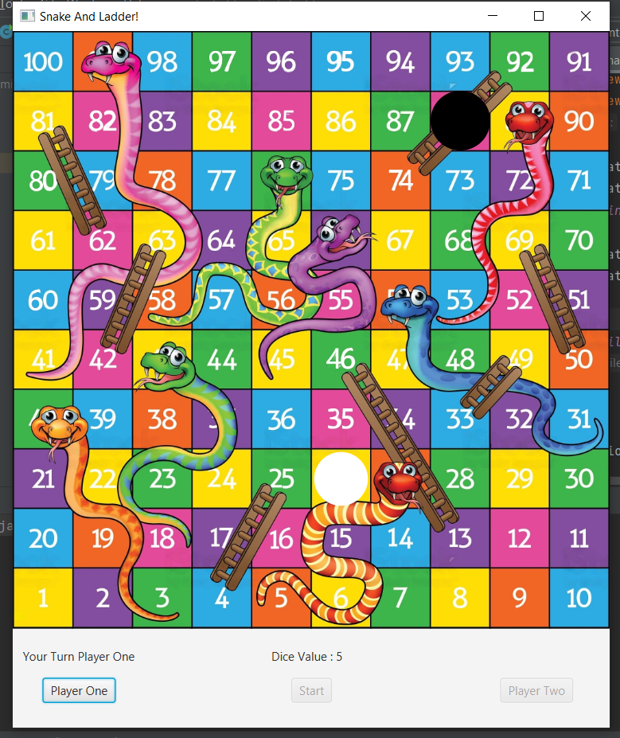

# Snake and Ladder Game



## Overview

This repository contains a 2-player Snake and Ladder game developed using JavaFX and Java. The game aims to recreate the classic board game experience with modern graphics and interactive features.

## Features

- JavaFX-based graphical user interface for an engaging gaming experience.
- Dice rolling mechanism to determine player movements.
- Classic Snake and Ladder mechanics with random board configurations.
- 2-player mode for head-to-head competition.

## Technologies Used

- Java: Core programming language for game logic.
- JavaFX: Framework used for creating the graphical user interface.
- IDE: Integrated Development Environment (e.g., IntelliJ, Eclipse) for coding and testing.

## How to Play

1. Clone the repository:

```bash
git clone  https://github.com/sahildongre20/Snake-and-Ladder
cd snake-and-ladder
